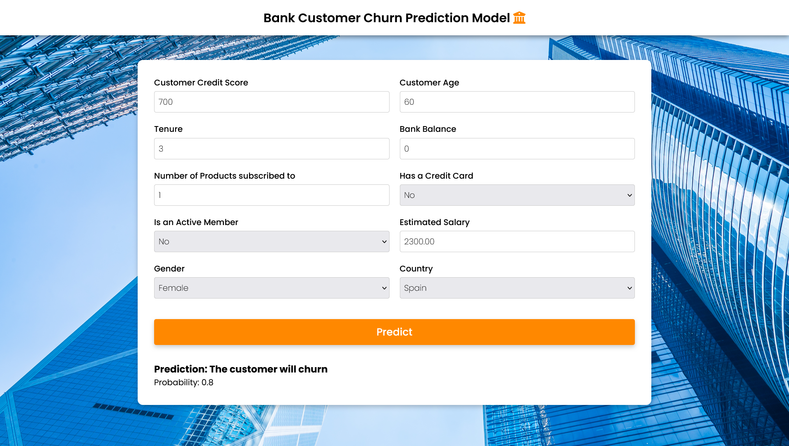
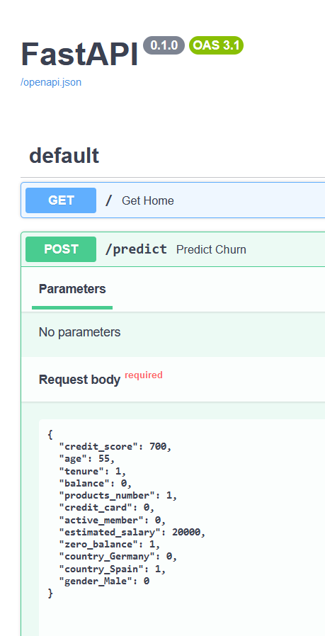
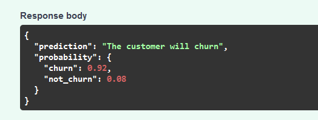

Bank Customer Churn Prediction Model 🏦
===

 

**Tech Stack Used**

## Project Overview

Using machine learning to predict which customers are likely to leave the bank. The aim is to recognize which users are probable to churn. We can input a customer data and get the result on whether this customer might stick with the bank or leave for another competitor based on the machine learning model. 

The data was trained and tested with 4 ML models. Class imbalance was addressed with SMOTE and compared how weights and resampling affect model perfomance. The preprocessing and EDA notebook is available under the `/notebooks` folder. 

| Model                                   | Accuracy | F1 Score | Precision | Recall   |
|-----------------------------------------|----------|----------|-----------|----------|
| Logistic Regression without oversampling | 0.718333 | 0.512406 | 0.395722  | 0.726678 |
| Logistic Regression with oversampling   | 0.624000 | 0.458733 | 0.324508  | 0.782324 |
| Random Forest without oversampling      | 0.858333 | 0.565884 | 0.752717  | 0.453355 |
| Random Forest with oversampling         | 0.797000 | 0.575017 | 0.501217  | 0.674304 |
| SVM without oversampling                | 0.796333 | 0.000000 | 0.000000  | 0.000000 |
| SVM with oversampling                   | 0.631333 | 0.462585 | 0.328956  | 0.779051 |
| XGB without oversampling                | 0.859000 | 0.595989 | 0.715596  | 0.510638 |
| XGB with oversampling                   | 0.315333 | 0.356516 | 0.220457  | 0.931260 |

after careful consideration, Random Forest was used for its robust performance. By further tuning the hyperparameters, following results were reached.

|    | Model                             | Accuracy  | F1_Score  | Precision | Recall   |
|----|-----------------------------------|-----------|-----------|-----------|----------|
| 0  | Random Forest without oversampling | 0.858333  | 0.565864  | 0.752717  | 0.453535 |
| 1  | Random Forest with oversampling    | 0.797000  | 0.575017  | 0.501217  | 0.674340 |
| 2  | Random Forest without oversampling tuned | 0.867333  | 0.583862  | 0.808696  | 0.456628 |
| 3  | Random Forest with oversampling tuned | 0.795333  | 0.576552  | 0.498212  | 0.684124 |

**Reasons for current performance constraints**

Churning is not completely predictable and it's seen that there is not a single variable that has a correlation against churning with a value over 0.5. So it's safe to assume that correlation cannot just be captured by the features in the dataset and there's many other variables that impact on customer churn. Yet, our model can distinguish between churning and non churning customers with over 80% of accuracy.

Oversampling with SMOTE, working with model weights, optimizing hyperparameters and preprocessing has contributed towards teaching this performance.
The model was serialized and deployed to an API endpoint with Fast API and this was connected to a frontend to add interactivity. API endpoints can be accessed directly by accessing the `/docs` endpoint. Finally a front end was made with plain HTML, CSS and JS. Inputs were sanitized with data validation in the front end while pydantic handles data structuring in the backend.

## Setting up the environment ( to run the project on a local machine )

create a virtual environment :  
`python3 -m venv mlprojectenv`

instantiate the environment:  
`.\mlprojectenv\Scripts\activate`

download the dependencies:  
`pip install -r requirements.txt`

donwload the extensions for jupyter in vs code/ preferred editor

Initialize the server
`uvicorn main:app --reload`

navigate to the localhost 8080 port on any browser.
`http://127.0.0.1:8000/`

---

